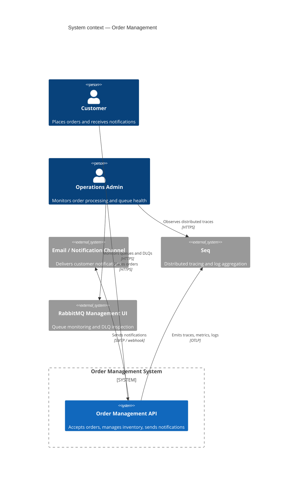
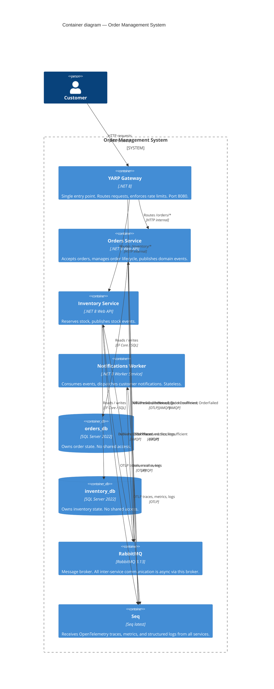
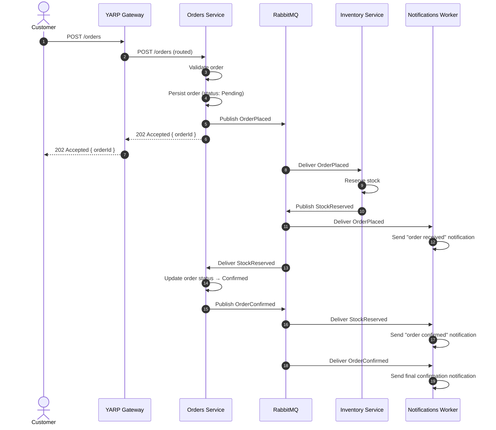
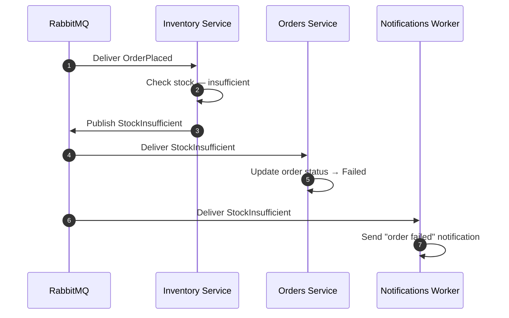

# Microservices Reference Architecture

> A production-grade .NET 8 microservices reference architecture built to demonstrate
> architectural thinking for Lead / Staff / Principal Engineer roles. Three bounded contexts,
> event-driven communication, database-per-service, and end-to-end distributed tracing —
> all running locally with a single command.

[](https://github.com/harshil-sh/microservices-reference-arch/actions)
[](LICENSE)

---

## Table of contents

1. [Project context](#1-project-context)
2. [Architecture overview](#2-architecture-overview)
3. [C4 context diagram](#3-c4-context-diagram)
4. [C4 container diagram](#4-c4-container-diagram)
5. [Event flow](#5-event-flow)
6. [Services and components](#6-services-and-components)
7. [Key architectural decisions](#7-key-architectural-decisions)
8. [Tech stack](#8-tech-stack)
9. [Project structure](#9-project-structure)
10. [How to run locally](#10-how-to-run-locally)
11. [How to observe a request end to end](#11-how-to-observe-a-request-end-to-end)
12. [Services and ports reference](#12-services-and-ports-reference)
13. [Running tests](#13-running-tests)
14. [What I would add for production](#14-what-i-would-add-for-production)
15. [Author](#15-author)

---

## 1. Project context

This repository is a reference implementation of a microservices architecture built
specifically to demonstrate architectural thinking at Lead / Staff / Principal Engineer
level. It is not a tutorial and not a CRUD demo — it is a deliberate exercise in making
and documenting the trade-offs that define real distributed systems.

The business domain is **Order Management** — chosen because it decomposes naturally into
independent bounded contexts, has genuine asynchronous communication requirements, and maps
directly to financial services transaction processing environments where this stack is
commonly used.

Every structural decision in this repository has a documented Architecture Decision Record
in `docs/adr/`. Every constraint is enforced structurally, not just by convention. The
observability stack is wired from the first commit so that a single business transaction
is traceable end-to-end across all three services in Seq.

**This project directly supports interview preparation for Senior / Lead / Staff roles
at companies including Kainos, Thoughtworks, Version 1, Capgemini, and equivalent
engineering-led organisations.**

---

## 2. Architecture overview

Three independently deployable services communicate exclusively via asynchronous events
through RabbitMQ. No service calls another service via HTTP. Each service owns its own
SQL Server database — no shared tables, no shared connection strings, no cross-database
queries.

All external traffic enters through a YARP gateway. All telemetry — traces, metrics, and
structured logs — flows through OpenTelemetry to Seq, where a single `OrderId` query
reveals the complete distributed trace across all three services and every event handler.

```
Zero synchronous inter-service calls.
Database per service — enforced structurally.
All external traffic via gateway.
Observability from day one.
Services independently deployable.
```

These five constraints are non-negotiable. Each is documented in an ADR with full
reasoning and trade-offs.

---

## 3. C4 context diagram



---

## 4. C4 container diagram



---

## 5. Event flow

The sequence below shows a successful order placement. Every arrow between services is
an asynchronous RabbitMQ event — there are no synchronous HTTP calls between services.



### Failure path — insufficient stock



---

## 6. Services and components

| Component | Technology | Responsibility |
|---|---|---|
| Orders Service | .NET 8 Web API | Accepts orders, manages order lifecycle, publishes domain events |
| Inventory Service | .NET 8 Web API | Reserves stock, publishes stock reservation events |
| Notifications Worker | .NET 8 Worker Service | Stateless event consumer — dispatches notifications |
| YARP Gateway | .NET 8 + YARP | Single entry point, routing, rate limiting |
| RabbitMQ | RabbitMQ 3.13 | Async message broker for all inter-service communication |
| OpenTelemetry | OTel SDK (.NET) | Traces, metrics, and structured log instrumentation |
| Seq | Seq latest | Distributed trace visualisation and log aggregation |
| orders_db | SQL Server 2022 | Orders Service exclusive — no shared access |
| inventory_db | SQL Server 2022 | Inventory Service exclusive — no shared access |

### Why Notifications has no database

The Notifications Worker is stateless by design. It receives an event, dispatches a
notification, and moves on. It owns no domain state. If notification history were required,
that would be a new bounded context with its own service and database — not a table bolted
onto the worker. The absence of a database here is an intentional architectural decision,
not an omission.

### Why two SQL Server containers and not one

A single SQL Server instance hosting both `orders_db` and `inventory_db` would satisfy the
letter of database-per-service but not the spirit. Two separate containers makes the
isolation structurally unambiguous — there is no shared server, no shared instance
configuration, and no path by which one service could accidentally access the other's data.

---

## 7. Key architectural decisions

Five ADRs document the non-negotiable constraints of this architecture. Each decision has
full context, consequences, and alternatives considered.

| ADR | Decision | Why it matters |
|---|---|---|
| [ADR 001](docs/adr/001-database-per-service.md) | Database per service — enforced via separate containers | Prevents hidden coupling at the data layer |
| [ADR 002](docs/adr/002-async-only-inter-service-comms.md) | Async-only inter-service communication via RabbitMQ | Temporal decoupling — services survive each other's downtime |
| [ADR 003](docs/adr/003-gateway-single-entry-point.md) | YARP gateway as single external entry point | Single place for cross-cutting concerns, hides internal topology |
| [ADR 004](docs/adr/004-opentelemetry-first.md) | OpenTelemetry instrumentation from day one | Retrofitting observability is exponentially harder |
| [ADR 005](docs/adr/005-eventual-consistency.md) | Eventual consistency as the default model | Strong consistency in distributed systems requires unacceptable coupling |

---

## 8. Tech stack

| Layer | Technology |
|---|---|
| Services | .NET 8 Web API · .NET 8 Worker Service · C# |
| Gateway | YARP (Yet Another Reverse Proxy) — .NET native |
| Messaging | RabbitMQ 3.13 + MassTransit (transport-agnostic abstraction) |
| Databases | SQL Server 2022 (Docker) · Entity Framework Core 8 |
| Observability | OpenTelemetry SDK · Serilog · Seq |
| Architecture | Clean Architecture per service · CQRS · MediatR |
| Infrastructure | Docker Compose |
| Testing | xUnit · Moq · Testcontainers |

---

## 9. Project structure

```
microservices-reference-arch/
├── docs/
│   ├── architecture.md              ← detailed system design
│   ├── events.md                    ← formal event catalogue
│   ├── runbook.md                   ← debugging and operations guide
│   └── adr/                         ← five architecture decision records
├── src/
│   ├── Gateway/
│   │   └── Gateway.API/             ← YARP reverse proxy
│   ├── Services/
│   │   ├── Orders/                  ← Clean Architecture (API/Application/Domain/Infrastructure)
│   │   ├── Inventory/               ← Clean Architecture (API/Application/Domain/Infrastructure)
│   │   └── Notifications/
│   │       └── Notifications.Worker/
│   └── Shared/
│       ├── Shared.Contracts/        ← event message schemas only
│       └── Shared.Observability/    ← OpenTelemetry setup, shared across services
├── docker-compose.yml
├── docker-compose.override.yml
├── .env.example
├── ARCHITECTURE_BRIEF.md
└── README.md
```

---

## 10. How to run locally

**Prerequisites:** Docker Desktop, .NET 8 SDK, Git.

```bash
# 1. Clone the repository
git clone https://github.com/harshil-sh/microservices-reference-arch
cd microservices-reference-arch

# 2. Copy environment variables
cp .env.example .env
# Edit .env and set your preferred database passwords

# 3. Start the full stack
docker-compose up
```

That is the entire setup. Docker Compose starts all services, both databases, RabbitMQ,
and Seq together. No manual database migrations — EF Core applies migrations on startup.

**Place an order:**

```bash
curl -X POST http://localhost:8080/orders \
  -H "Content-Type: application/json" \
  -d '{
    "customerId": "3fa85f64-5717-4562-b3fc-2c963f66afa6",
    "items": [
      { "productId": "a1b2c3d4-0000-0000-0000-000000000001", "quantity": 2 }
    ]
  }'
```

Response:

```json
{
  "orderId": "...",
  "status": "Pending",
  "message": "Order accepted. Processing asynchronously."
}
```

**Check order status:**

```bash
curl http://localhost:8080/orders/{orderId}
```

---

## 11. How to observe a request end to end

This walkthrough demonstrates the distributed tracing capability of the architecture.
A single `OrderId` reveals the complete journey across all three services in Seq.

**Step 1 — Place an order**

```bash
curl -X POST http://localhost:8080/orders \
  -H "Content-Type: application/json" \
  -d '{ "customerId": "...", "items": [{ "productId": "...", "quantity": 1 }] }'
```

Note the `orderId` returned in the response.

**Step 2 — Open RabbitMQ management UI**

Navigate to `http://localhost:15672` (username: `guest`, password: `guest`).

Observe the `order.placed` queue receive and process the message. Check the
`order.placed.dlq` queue — it should be empty on a successful order.

**Step 3 — Open Seq**

Navigate to `http://localhost:8081`.

In the search bar, enter the `orderId` from Step 1. You will see all structured log
entries from all three services correlated by that single ID.

**Step 4 — View the distributed trace**

Switch to the Traces view in Seq. Find the trace initiated by the `POST /orders` request.
Expand it to see the full span tree:

```
POST /orders  (Gateway)
  └── POST /orders  (Orders Service)
        └── Publish: OrderPlaced  (Orders Service → RabbitMQ)
              ├── Consume: OrderPlaced  (Inventory Service)
              │     └── Publish: StockReserved
              │           └── Consume: StockReserved  (Orders Service)
              │                 └── Publish: OrderConfirmed
              └── Consume: OrderPlaced  (Notifications Worker)
```

**Step 5 — Confirm final order status**

```bash
curl http://localhost:8080/orders/{orderId}
# status should be "Confirmed"
```

---

## 12. Services and ports reference

| Service | Internal port | External port | UI URL |
|---|---|---|---|
| YARP Gateway | 80 | **8080** | — |
| Orders Service | 80 | internal only | `http://localhost:8080/orders/swagger` |
| Inventory Service | 80 | internal only | `http://localhost:8080/inventory/swagger` |
| Notifications Worker | — | — | — |
| RabbitMQ (AMQP) | 5672 | 5672 | — |
| RabbitMQ (Management) | 15672 | **15672** | `http://localhost:15672` |
| Seq (OTLP ingestion) | 5341 | 5341 | — |
| Seq (UI) | 80 | **8081** | `http://localhost:8081` |
| orders_db | 1433 | internal only | — |
| inventory_db | 1433 | **1434** | — |

Individual service ports are not exposed externally. All API traffic goes through the
gateway on port 8080. This mirrors production topology.

---

## 13. Running tests

**All tests:**

```bash
dotnet test
```

**Per service:**

```bash
dotnet test src/Services/Orders/
dotnet test src/Services/Inventory/
```

**With coverage:**

```bash
dotnet test --collect:"XPlat Code Coverage"
```

Tests use Testcontainers to spin up real SQL Server and RabbitMQ instances for integration
tests — no mocking of infrastructure dependencies in integration test suites.

---

## 14. What I would add for production

This section documents the gap between a reference architecture and production-ready
infrastructure. These items are excluded deliberately to keep the reference focused — not
because they are unknown.

**Infrastructure and deployment**
- Kubernetes manifests and Helm charts for each service
- Horizontal pod autoscaling per service based on RabbitMQ queue depth
- Azure Service Bus replacing RabbitMQ — one-line MassTransit transport config change
- Azure Key Vault for secrets — replace `.env` file with managed identity auth

**Resilience**
- Polly circuit breakers on all outbound calls from the gateway
- Retry policies with exponential backoff on all event consumers (currently three retries)
- Health check endpoints on all services with readiness and liveness probes
- Chaos engineering tests (simulated service failures, network partitions)

**Observability**
- Grafana dashboards visualising the OpenTelemetry metrics per service
- Alerting rules on queue depth, DLQ message count, and error rate
- Distributed tracing sampling strategy for high-volume production traffic

**Data and domain**
- Inventory Service migrated to a document database (Cosmos DB or MongoDB) as product
  catalogue complexity grows — each service can choose the right database for its data model
- A Payments Service as the fourth bounded context with its own saga and compensating
  transactions
- Read model projections for reporting queries across service boundaries
- API versioning strategy enforced at the gateway level

**Security**
- JWT validation at the gateway — services receive pre-validated claims
- mTLS between internal services within the cluster
- Network policies restricting inter-service communication to declared dependencies only

---

## 15. Author

**Harshil Shah** — Senior Full Stack Engineer

14+ years delivering scalable, cloud-native enterprise applications across financial
services and regulatory sectors. Currently architecting Azure-based microservices at
Ofgem (UK National Energy Regulator). Winner of the Asian Banker Award for Best Retail
Banking Software.

- GitHub: [github.com/harshil-sh](https://github.com/harshil-sh)
- LinkedIn: [linkedin.com/in/harshilmayurshah](https://linkedin.com/in/harshilmayurshah)
- Engineering Playbook: [harshil-sh.github.io/engineering-playbook](https://harshil-sh.github.io/engineering-playbook)
- Email: harshil.sh@gmail.com

---

*Built as part of a senior engineering portfolio targeting Lead / Staff / Principal
Engineer roles across UK, Netherlands, Germany, and Ireland.*
